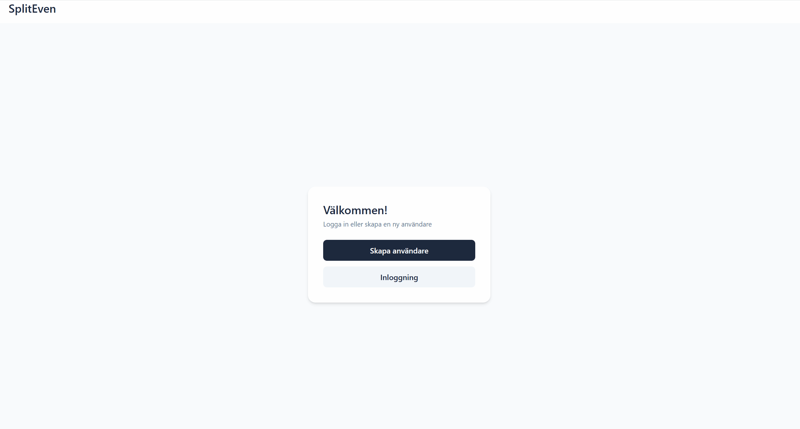
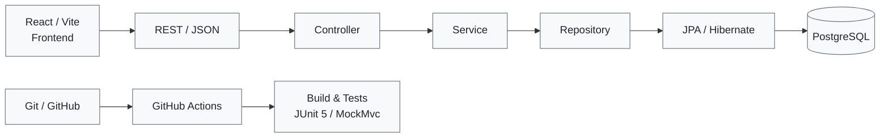
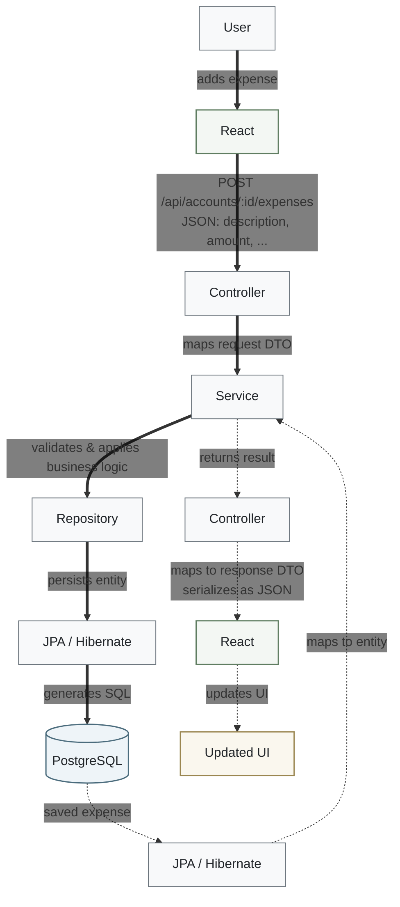

# SplitEven


Demo: Logs in, reviews the current balance, and records a 500 SEK expense. The balance updates from −250 SEK to 0 SEK, and the new expense appears in the expense list.


## Purpose

SplitEven was developed as a personal fullstack project to deepen my practical understanding of modern web development. The project covers the entire development stack, from database design and a Spring Boot REST API to a React frontend, automated testing and CI/CD. It was also used to gain hands-on experience with the interaction between these technologies and development practices.

## Tech stack

Java · Spring Boot · React · PostgreSQL · JPA/Hibernate ·
JUnit · GitHub Actions

## Contents

- [Project structure](#project-structure)
- [Main features](#main-features)
- [Architecture & Workflow](#architecture--workflow)
- [Request flow](#request-flow)
- [Requirements](#requirements)
- [Setup](#setup)
- [Run the application](#run-the-application)
- [Validation](#validation)

## Project structure


- `frontend/` - React and Vite user interface
- `backend/` - Spring Boot REST API and application logic
- `backend/sql/` - Database schema scripts
- `Cheat-Sheets/` - Project learning notes and technology references

## Main features

- Create and manage user profiles
- Create shared accounts and invite members
- Add expenses and income
- Calculate balances between account members
- Review balances for a selected period
- Send email notifications for account invitations


## Architecture & Workflow

SplitEven is structured as a React frontend communicating with a Spring Boot REST API. The backend follows a Controller–Service–Repository structure, with application logic 
implemented through services. DTOs define the shape of API requests and responses, and mappers convert between DTOs and JPA entities so persistence details never leak into the 
API layer. JPA/Hibernate handles persistence of Java entities in PostgreSQL.

Automated tests are written with JUnit and MockMvc and run through GitHub Actions as part of the CI pipeline.



## Request flow

When a user adds an expense, React sends a JSON request to the Spring Boot REST API. The Controller receives the request and works with a request DTO, while the Service layer validates the data and applies the application logic. A mapper converts between DTOs and JPA entities, and the Repository delegates persistence to JPA/Hibernate, which generates the SQL used to store the expense in PostgreSQL.

After the expense has been saved, JPA/Hibernate maps the persisted data back to an entity. The result is returned through the Service layer to the Controller, where it is mapped to a response DTO and serialized as JSON before being sent back to React. React receives the response and updates the UI with the new expense and balance.

Arrow types in the flowchart:

- **Solid arrows (`➔`)** represent the primary request flow — the path data takes from the user's action toward the database.
- **Dashed arrows (`⇢`)** represent the response flow — the saved data being mapped back into the application and returned to React.





## Requirements


- Node.js and npm
- Java 21
- PostgreSQL


## Setup

1. Install the root development tools:

   ```bash
   npm install
   ```

2. Install frontend dependencies:

   ```bash
   cd frontend
   npm install
   cd ..
   ```

3. Create your local environment file from the committed template:

   ```bash
   cp .env.example .env
   ```

   Replace the placeholder mail values in `.env`. The `.env` file is ignored by Git.

4. Create a PostgreSQL database named `spliteven` and apply `backend/sql/schema.sql`.

5. Configure the database settings in `backend/src/main/resources/application.properties`.
   The application uses `ddl-auto=validate`, so the schema must already exist.

6. The mail credentials from `.env` are loaded automatically when using `npm run dev` from the project root. When running the backend directly, export them in the shell first if invitation emails are needed.

## Run the application

Start both the backend and frontend from the project root:

```bash
npm run dev
```

The frontend runs at `http://localhost:5173` and the backend runs at `http://localhost:8080`.

To run either service separately, see the README in its directory.

## Validation

```bash
cd frontend
npm run lint
npm run build

cd ../backend
./mvnw test
```
